<div align="center">

<picture>
  <source media="(prefers-color-scheme: dark) and (max-width: 600px)" srcset="./assets/hero/agent-console-8567d39d-mobile-dark.svg">
  <source media="(prefers-color-scheme: light) and (max-width: 600px)" srcset="./assets/hero/agent-console-8567d39d-mobile-light.svg">
  <source media="(prefers-color-scheme: dark)" srcset="./assets/hero/agent-console-8567d39d-dark.svg">
  <source media="(prefers-color-scheme: light)" srcset="./assets/hero/agent-console-8567d39d-light.svg">
  
</picture>

</div>


## `01` — ABOUT
<div align="center">

<a href="https://capsule-render.vercel.app/"></a>

<a href="https://git.io/typing-svg">

</a>

<br/>


<br/><br/>

<a href="https://anbuthamizhan.web.app/"></a> <a href="https://www.linkedin.com/in/Anbuthamizhan"></a> <a href="mailto:anbuanbuthamizh@gmail.com"></a> <a href="https://github.com/Anbuthamizh-2004"></a>

<br/><br/>


</div>

---

## `01` — ABOUT

I am a **Computer Science Engineering student and Java Full Stack Developer** focused on building scalable, secure, responsive, and user-oriented software applications.

My engineering foundation spans **frontend development, backend engineering, database systems, RESTful API integration, and full-stack application development**. I enjoy transforming ideas into maintainable products while continuously improving my problem-solving and engineering capabilities.

I have hands-on experience developing full-stack applications using **Java, Servlets, JDBC, MySQL, HTML5, CSS3, JavaScript, and React.js**, with practical exposure to debugging, testing, deployment, and team-based software development.

### Engineering Mindset

* Building maintainable and scalable applications
* Designing responsive and intuitive user interfaces
* Developing secure backend services and REST APIs
* Working with relational databases and efficient data operations
* Applying structured problem-solving to engineering challenges
* Learning modern technologies and improving continuously
* Collaborating effectively in software development teams

### Open To

`Software Engineering` `Java Full Stack Development` `Frontend Development` `Backend Development` `Internships` `Entry-Level Opportunities` `Collaborative Projects`

---

## `02` — TECH STACK

### Languages

<p>

</p>

### Frontend

<p>

</p>

`Responsive Web Design` `REST API Integration`

### Backend & Databases

<p>

</p>

`Java` `Servlets` `JDBC` `Server-side Validation` `Session Management`

### Cloud, DevOps & Tooling

<p>

</p>

`Git` `GitHub` `VS Code` `Eclipse` `Apache Tomcat` `Postman` `Firebase` `MS Office 365`

---

## `03` — AI / ML EXPERTISE

> AI/ML technologies are not listed in the provided resume. This section therefore reflects an engineering direction rather than claiming certifications or professional AI/ML experience.

| Domain                   | Proficiency | Details                                                                        |
| ------------------------ | ----------- | ------------------------------------------------------------------------------ |
| AI / ML Foundations      | Exploring   | Building foundational knowledge alongside software engineering                 |
| Intelligent Applications | Exploring   | Interested in integrating intelligent capabilities into software products      |
| Full Stack + AI          | Exploring   | Exploring ways to combine application engineering with AI-driven functionality |
| Product Engineering      | Developing  | Focused on translating technical capabilities into practical applications      |

---

## `04` — FEATURED PROJECTS

<details>
<summary><b>Event Management System</b></summary>

### Overview

An application designed to manage **events, registrations, and schedules**, with emphasis on organized data management and improved user interaction.

| Dimension       | Details                                               |
| --------------- | ----------------------------------------------------- |
| **Stack**       | Full Stack Web Development                            |
| **Scale**       | Academic / Project                                    |
| **Performance** | Focused on efficient data organization                |
| **Security**    | Application-level validation and structured access    |
| **Impact**      | Improved event organization and user interaction      |
| **Repository**  | [GitHub Profile](https://github.com/Anbuthamizh-2004) |

### Engineering Scope

* Designed functionality for event management
* Supported event registration workflows
* Organized event scheduling information
* Improved data organization
* Focused on better user interaction

</details>

<details>
<summary><b>Student Management System</b></summary>

### Overview

A database-driven student management application implementing **CRUD operations with JDBC and MySQL**.

| Dimension       | Details                                               |
| --------------- | ----------------------------------------------------- |
| **Stack**       | Java, JDBC, MySQL                                     |
| **Scale**       | Academic / Project                                    |
| **Performance** | Efficient data storage and retrieval                  |
| **Security**    | Structured database interaction                       |
| **Impact**      | Simplified student data management                    |
| **Repository**  | [GitHub Profile](https://github.com/Anbuthamizh-2004) |

### Engineering Scope

* Implemented Create, Read, Update, and Delete operations
* Connected Java applications with MySQL
* Used JDBC for database communication
* Designed efficient data storage and retrieval workflows

</details>

<details>
<summary><b>IdeaNest — TPO Collaboration Project</b></summary>

### Overview

A collaborative platform focused on **idea sharing, teamwork, and innovation**, developed as a team-oriented project.

| Dimension       | Details                                               |
| --------------- | ----------------------------------------------------- |
| **Stack**       | Full Stack Web Development                            |
| **Scale**       | Collaborative Academic Project                        |
| **Performance** | Focused on organized idea workflows                   |
| **Security**    | Application-level validation                          |
| **Impact**      | Encouraged idea sharing and teamwork                  |
| **Repository**  | [GitHub Profile](https://github.com/Anbuthamizh-2004) |

### Engineering Scope

* Collaborated with team members throughout development
* Developed and refined innovative ideas
* Built functionality for idea sharing
* Improved collaboration workflows
* Strengthened problem-solving and team development skills

</details>

---

## `05` — EXPERIENCE

### Java Full Stack Developer Intern · Edu Tantr Private Limited

`3 Months` · `Bengaluru`

Java Full Stack Developer Intern with hands-on experience developing full-stack web applications using **Java, Servlets, MySQL, JDBC, RESTful APIs, and responsive frontend technologies**.

#### Scope of Work

* Developed full-stack web applications using **Java, Servlets, and MySQL**
* Designed responsive user interfaces
* Integrated backend services with frontend applications
* Implemented RESTful APIs
* Performed database operations using JDBC
* Collaborated with team members during development
* Participated in debugging and testing
* Supported application deployment workflows

#### Skills

`Java` `Servlets` `JDBC` `MySQL` `REST APIs` `HTML5` `CSS3` `JavaScript` `Responsive Web Design` `Git` `GitHub`

---

## `06` — ACHIEVEMENTS

<div align="center">

| Recognition                       | Details                                                   |
| --------------------------------- | --------------------------------------------------------- |
| **Team Lead — Academic Projects** | Led multiple full-stack development projects successfully |
| **Project Leadership**            | Managed task distribution, debugging, and deployment      |
| **Delivery & Documentation**      | Ensured timely delivery and proper project documentation  |

</div>

---

## `07` — CERTIFICATIONS

> No certifications were listed in the provided resume.

| Provider | Status       |
| -------- | ------------ |
| AWS      | Not provided |
| Oracle   | Not provided |
| NPTEL    | Not provided |
| Cisco    | Not provided |

---

## `08` — CODING PROFILES

<div align="center">

<a href="https://leetcode.com/u/ANBUTHAMIZHAN/">

</a>

<a href="https://www.hackerrank.com/anbuanbuthamizh">

</a>

<a href="https://www.geeksforgeeks.org/user/anbuanbu0o55/">

</a>

<a href="https://www.codechef.com/users/anbuthamizh_21">

</a>

</div>

---

## `09` — GITHUB ANALYTICS

<div align="center">

<a href="https://github.com/Anbuthamizh-2004">

</a>

<a href="https://github.com/Anbuthamizh-2004">

</a>

<br/>

<a href="https://github.com/Anbuthamizh-2004">

</a>

</div>

---

## `10` — GITHUB TROPHIES

<div align="center">

<a href="https://github.com/Anbuthamizh-2004">

</a>

</div>

---

## `11` — CONTRIBUTION ACTIVITY

<div align="center">

<a href="https://github.com/Anbuthamizh-2004">

</a>

</div>

---

## `12` — CONTRIBUTION SNAKE

<div align="center">

<picture>
  <source media="(prefers-color-scheme: dark)" srcset="https://raw.githubusercontent.com/Anbuthamizh-2004/Anbuthamizh-2004/output/github-contribution-grid-snake-dark.svg">
  <source media="(prefers-color-scheme: light)" srcset="https://raw.githubusercontent.com/Anbuthamizh-2004/Anbuthamizh-2004/output/github-contribution-grid-snake.svg">
  
</picture>

</div>

---

## `13` — CURRENT FOCUS

```yaml
current_focus:
  learning:
    - Advanced Full Stack Development
    - Modern JavaScript Ecosystem
    - Software Engineering Best Practices

  building:
    - Scalable Web Applications
    - Full Stack Projects
    - Collaborative Developer Products

  exploring:
    - AI-powered Software Applications
    - Modern Development Tooling
    - Cloud and Application Engineering

  open_to:
    - Software Engineering Opportunities
    - Java Full Stack Roles
    - Frontend / Backend Development
    - Collaborative Open Source Projects
```

---

## `14` — CONNECT

<div align="center">

<a href="mailto:anbuanbuthamizh@gmail.com">

</a>

<a href="https://www.linkedin.com/in/Anbuthamizhan">

</a>

<a href="https://github.com/Anbuthamizh-2004">

</a>

<a href="https://anbuthamizhan.web.app/">

</a>

</div>

---

<div align="center">

### *"Build with purpose. Engineer with precision. Keep learning."*

<br/>

<a href="https://capsule-render.vercel.app/"></a>

</div>
